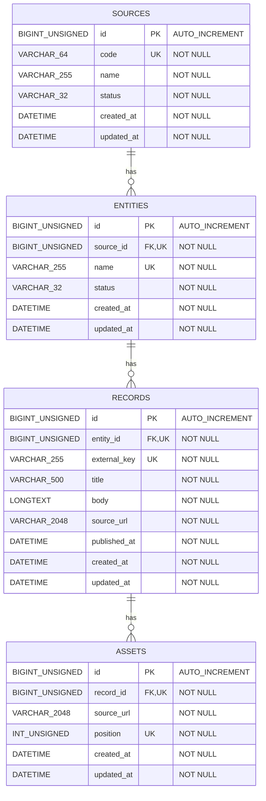

# ER Diagram

## Key

- `PK`: Primary Key
- `FK`: Foreign Key
- `UK`: Unique Key. Multiple columns marked `UK` in the same table form a composite unique key where specified below.

## Unique Keys

- `sources`: `UNIQUE(code)`
- `entities`: `UNIQUE(source_id, name)`
- `records`: `UNIQUE(entity_id, external_key)`
- `assets`: `UNIQUE(record_id, position)`

## Notes

- All primary keys use `BIGINT UNSIGNED AUTO_INCREMENT`.
- `sources.status` and `entities.status` are represented by application-side string enums.
