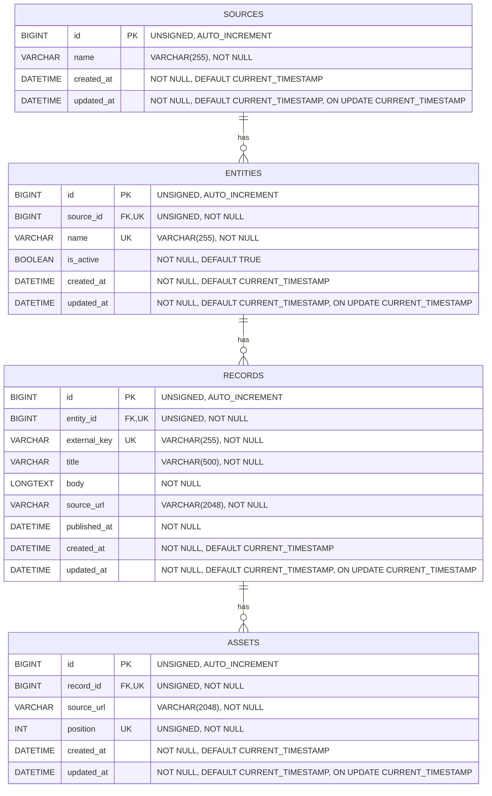

# ER Diagram

## Key

- `PK`: Primary Key
- `FK`: Foreign Key
- `UK`: Unique Key. Multiple columns marked `UK` in the same table form a composite unique key where specified below.

## Unique Keys

- `entities`: `UNIQUE(source_id, name)`
- `records`: `UNIQUE(entity_id, external_key)`
- `assets`: `UNIQUE(record_id, position)`

## Foreign Keys

- `entities.source_id` → `sources.id` (`ON DELETE RESTRICT`)
- `records.entity_id` → `entities.id` (`ON DELETE RESTRICT`)
- `assets.record_id` → `records.id` (`ON DELETE RESTRICT`)

## Notes

- All primary keys use `BIGINT UNSIGNED AUTO_INCREMENT`.
- `entities.is_active` is a boolean flag and defaults to `TRUE`.
- `created_at` defaults to `CURRENT_TIMESTAMP`.
- `updated_at` defaults to `CURRENT_TIMESTAMP` and is automatically updated with `ON UPDATE CURRENT_TIMESTAMP`.
- `records.published_at` is source data and has no default value.
