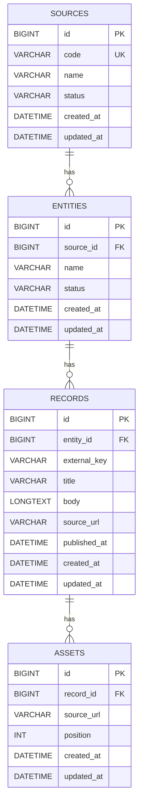

# ER Diagram

## Constraints

- All primary keys use `BIGINT UNSIGNED AUTO_INCREMENT`.
- `sources.code` is unique.
- `entities` has a unique constraint on `(source_id, name)`.
- `records` has a unique constraint on `(entity_id, external_key)`.
- `assets` has a unique constraint on `(record_id, position)`.
- `sources.status` and `entities.status` are represented by application-side string enums.
